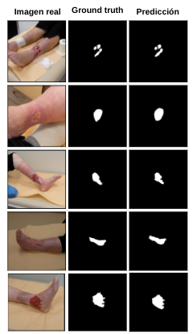
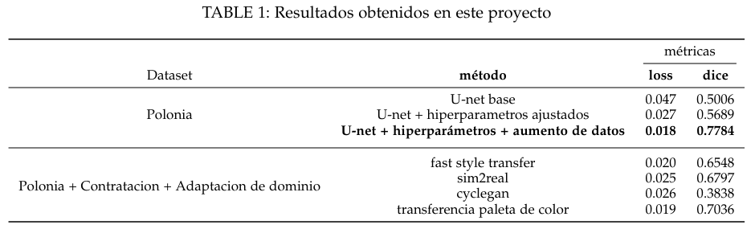
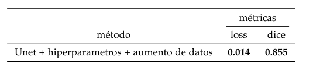

# Segmentacion de heridas cronicas con Deep Learning

  

## Introduccion

Este repositorio contiene el codigo fuente de un proyecto de segmentacion de heridas cronicas con Deep Learning para dos datasets, uno de polonia y otro de contratacion (Colombia). El proyecto se realizo en el marco de la materia de Analisis numerico en la carrera de Ingenieria de sistemas en la Universidad Industrial De Santander

Se implemento una red neuronal convolucional UNET, apoyada con tecnicas de data augmentation y adaptacion de dominio, para evaluar su desempeño en la segmentacion de heridas cronicas en imagenes de la piel, se utilizo la metrica de DICE.

## Requerimientos

- Python 3.6
- Tensorflow 2.8.2

## Uso

Todo el codigo fuente se encuentra en el archivo `main.ipynb`. Para ejecutarlo se puede utilizar Google Colab o Jupyter Notebook.

Las imagenes utilizadas son privadas y no se encuentran disponibles en este repositorio. 

## Resultados

Se obtuvieron los siguientes resultados:

